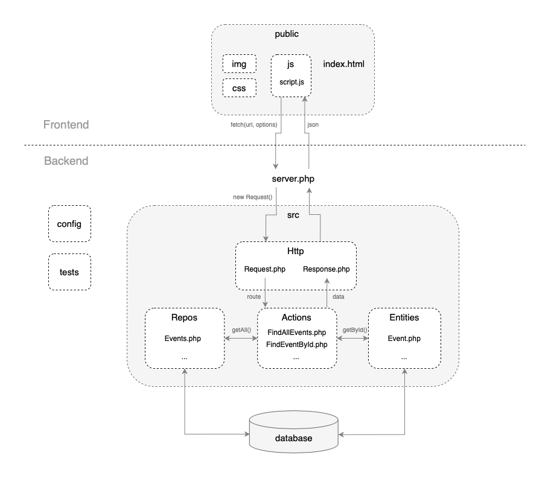

# Turku Events Hub

[](https://www.php.net/)
[](https://www.mysql.com/)
[](https://developer.mozilla.org/en-US/docs/Web/JavaScript)
[](https://getbootstrap.com/)
[](https://developer.mozilla.org/en-US/docs/Web/HTML)
[](https://developer.mozilla.org/en-US/docs/Web/CSS)

**Turku Events Hub** is a responsive full-stack web platform that helps users discover cultural and sports events happening in Turku. Built with PHP and MySQL on the backend and modern JavaScript with Bootstrap on the frontend, the project includes user registration, event filtering, and a clean, mobile-friendly UI.

<p align="center">
  <a href="https://turkuevents.online">
    
  </a>
</p>

## Features

- Browse upcoming concerts, movies, sports, and theatre events
- Filter events by category or date
- Responsive interface built with Bootstrap
- User authentication system (registration/login/logout)
- Architecture designed with MVC principles
- Clean URL routing and modular PHP backend
- Well-structured MySQL database with SQL dump included

## Technologies Used

### Backend

- PHP 7.x
- MySQL 8.x
- Composer (dependency management)

### Frontend

- HTML5, CSS3
- JavaScript
- Bootstrap 5

## Architecture

The platform follows a modular structure with clear separation between backend logic and frontend presentation. The backend uses an MVC-style pattern with organized actions, entities, HTTP layers, and repositories.



## Project Structure

```
backend/       → PHP source code (Actions, Entities, Repos, Config)
data/          → SQL dump of the project database
public/        → HTML pages, JS scripts, styles, and images
```

## Installation

1. Clone the repository:

   ```bash
   git clone <repository-url>
   cd turku-events-hub
   ```

2. Import the database schema:

   - Create a new MySQL database.
   - Import the SQL file: `data/turku_events.sql`.

3. Configure your credentials:

   - Open `backend/config/config.php` and set your database connection settings.

4. Serve the application:

   - Run a PHP local server:

     ```bash
     php -S localhost:8000 -t public
     ```

5. Access the site in your browser:

   ```
   http://localhost:8000
   ```
